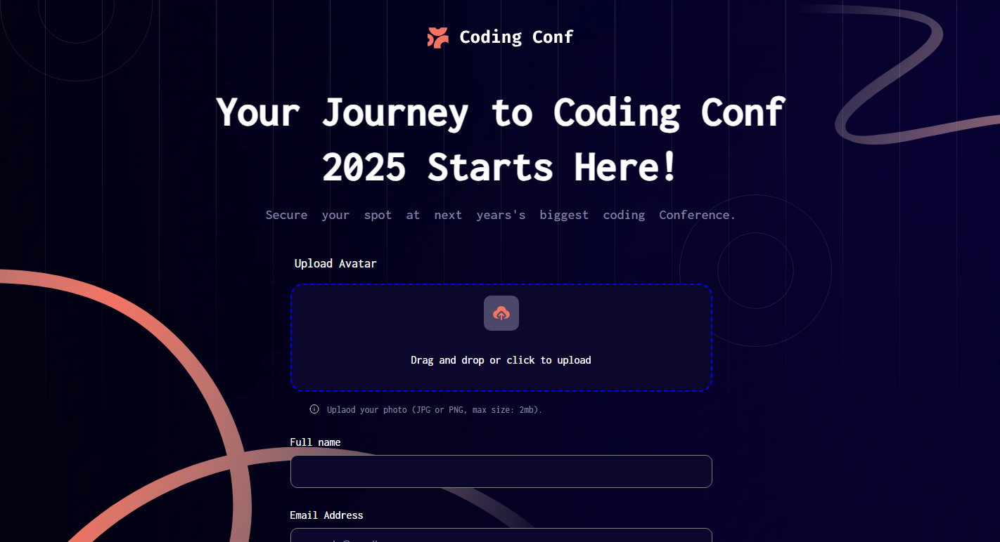

# Frontend Mentor - Conference ticket generator solution

This is a solution to the [Conference ticket generator challenge on Frontend Mentor](https://www.frontendmentor.io/challenges/conference-ticket-generator-oq5gFIU12w). Frontend Mentor challenges help you improve your coding skills by building realistic projects. 

## Table of contents

- [Overview](#overview)
  - [The challenge](#the-challenge)
  - [Screenshot](#screenshot)
  - [Links](#links)
- [My process](#my-process)
  - [Built with](#built-with)
  - [What I learned](#what-i-learned)
  - [Continued development](#continued-development)
  - [Useful resources](#useful-resources)
- [Author](#author)
- [Acknowledgments](#acknowledgments)

## Overview

### The challenge

Users should be able to:

- Complete the form with their details
- Receive form validation messages if:
  - Any field is missed
  - The email address is not formatted correctly
  - The avatar upload is too big 
- Have inputs, form field hints, and error messages announced on their screen reader
- See the generated conference ticket when they successfully submit the form
- View the optimal layout for the interface depending on their device's screen size
- See hover and focus states for all interactive elements on the page

### Screenshot




### Links

- Solution URL: [Add solution URL here](https://your-solution-url.com)
- Live Site URL: [Add live site URL here](https://your-live-site-url.com)

## My process

### Built with

- Semantic HTML5 markup
- CSS custom properties
- Flexbox
- JavaScript
- EventListeners


### What I learned

I Learnt a lot, spanning from CSS down to Javascript, which includes:
- Making my button function
- How to preview images before submiting
- How to use functions correctly
- How to make my website more responsive
- How to make my input appear at the other side of my web page
- How to convert my pictures to files
- How to make an "Upload Area"
- Learnt how to set up background images for my background


```css
body{
  height: 100vh;
  background: url("Assets/images/pattern-squiggly-line-bottom-desktop.svg") bottom left no-repeat fixed, url("Assets/images/pattern-squiggly-line-top.svg") top right no-repeat fixed, url("Assets/images/pattern-lines.svg") center no-repeat fixed, url("Assets/images/pattern-circle.svg") center right 20% no-repeat fixed, url("Assets/images/pattern-circle.svg") left top -100px no-repeat fixed, url("Assets/images/background-desktop.png");
     

}
```
```js
// VALIDATION 
//check if it's an image
function validateFile(file) {
    if(!file.type.startsWith("image/")) {
        alert("only images are allowed");
        location.reload();
        return false;
    }

   // check for image size
      const maxSize = 2 * 1024 * 1024;

      if(file.size > maxSize) {
      /*   location.reload(); */
      errorMessOne.style.display = "flex";
      infoOne.style.display = "none"; 
      dropArea.style.borderColor = "grey";
      preview.style.display = "none";
      first.style.display = "block";

      return false;
    } 

    return true;

}


// selecting manually
fileInput.addEventListener("change", function () {
    showPreview(this.files[0]);

    const file = fileInput.files[0];
    if(!validateFile(file)) {
        fileInput.value = "";
        return;
    }
});

// drag over
dropArea.addEventListener("dragover", (e) => {
    e.preventDefault();
    dropArea.style.borderColor = "blue";
});

//drag leave 
dropArea.addEventListener("dragleave", () => {
    dropArea.style.borderColor = "blue";
});

// drop 
dropArea.addEventListener("drop", (e) => {
    e.preventDefault();
    dropArea.style.borderColor = "blue";

    const file = e.dataTransfer.files[0];

    if(!validateFile(file)) return;

    showPreview(file);
});

function showPreview(file) {
    if(!file.type.startsWith("image/")) return;

    previewImg.src = URL.createObjectURL(file);
    preview.style.display = "block";
    first.style.display = "none";
    errorMessOne.style.display = "none";
    infoOne.style.display = "flex"; 

}

function buttonError(file) {
    if(!file.type.startsWith("image/")) return;

    dropArea.style.borderColor = "red";
}

removeBtn.addEventListener("click", () => {
    previewImg.src = "";
    first.style.display = "block";
    preview.style.display = "none";
});

changeBtn.addEventListener("click", (e) => {
    e.preventDefault();
    fileInput.click();
    showPreview(file);

    const file = e.dataTransfer.files[0];

    if(!validateFile(file)) return;
});

```

### Continued development

I still have a long way to go, I will try my best to Know more about javascript and even CSS and hope in the future, I will have no issues writing the code.


## Author
- Frontend Mentor - [@Wizdev0](https://www.frontendmentor.io/profile/Wizdev0)
- Twitter - [@otutech](https://www.twitter.com/otutech)
